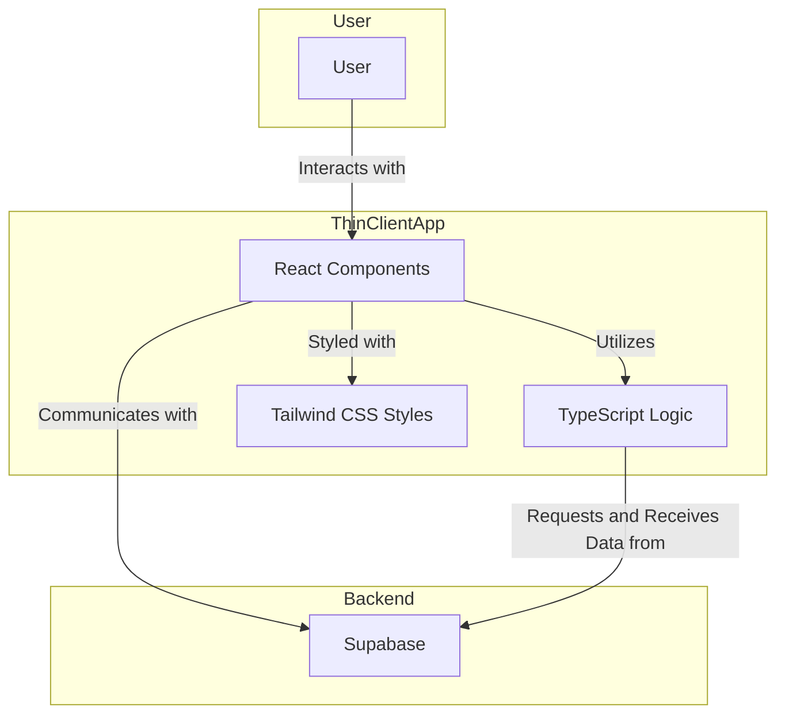

<div id="top"></div>

<div align="center">
  
  <h2>Whisper</h2>
  <p>An anonymous message application, to receive messages, q&a, compliments, advice, opinions, and more. It's up to you to cause chaos or spread love.
  </p> <p> It's an open source alternative to "NGL", "Sarahah" and "Kubool". </p>

  <p  align="center">
    <a href="https://trywhispr.vercel.app/">View Demo</a>
    ·
    <a href="https://github.com/hendurhance/whispr/issues/new?assignees=&labels=bug&template=bug.yml&title=%5BBUG%5D+%3Cdescription%3E">Report Bug</a>
    ·
    <a href="https://github.com/hendurhance/whispr/issues/new?assignees=&labels=feature&template=features.yml&title=%5BFEATURE%5D+%3Cdescription%3E">Request Feature</a>
  </p>

  
  
  
   </br>
</div>

## What is Whispr?
It's an anonymous message application, to receive messages, q&a, compliments, advice, opinions, and more. It's up to you to cause chaos or spread love. It's an open source alternative to "NGL", "Sarahah" and "Kubool" with respect to privacy and security.

## Features
- [ ] Anonymous messaging
- [ ] Anonymous Q&A
- [ ] Anonymous Compliments
- [ ] Anonymous Advice
- [ ] Anonymous Opinions
- [ ] Anonymous Polls
- [ ] Anonymous Confessions
- [ ] Anonymous Feedback
- [ ] Anonymous Suggestions
- [ ] Anonymous Secrets

## 💻 Tech Stack
<table>
  <tr>
    <td align="center"><a href="https://reactjs.org/"><br /><sub><b>React</b></sub></a><br /></td>
    <td align="center"><a href="https://www.typescriptlang.org/"><br /><sub><b>Typescript</b></sub></a><br /></td>
    <td align="center"><a href="https://www.supabase.io/"><br /><sub><b>Supabase</b></sub></a><br /></td>
    <td align="center"><a href="https://tailwindcss.com/"><br /><sub><b>Tailwind CSS</b></sub></a><br /></td>
    <td align="center"><a href="https://vercel.com/"><br /><sub><b>Vercel</b></sub></a><br /></td>
  </tr>
</table>

## 📸 Screenshots
_Coming soon_

## 🚀 Getting Started
### Prerequisites
- Git
- Node.js
- Yarn
- Git
- Supabase

### Installation
1. Clone the repo
   ```sh
   git clone https://github.com/hendurhance/whispr.git
   ```
2. Change directory
   ```sh
   cd whispr
   ```
3. Install NPM packages
   ```sh
    yarn install
    ```
    Or
    ```sh
    npm install
    ```
4. Create a `.env` from `.env.local` file in the root directory and add the following variables
   ```sh
   cp .env.local .env
    ```
    Then add the following variables
    ```sh
    REACT_APP_SUPABASE_URL=<supabase_url>
    REACT_APP_SUPABASE_ANON_KEY=<supabase_anon_key>
    ```
5. Run the app
    ```sh
    yarn start
    ```
    Or
    ```sh
    npm start
    ```
6. Open [http://localhost:3000](http://localhost:3000) to view it in the browser.
7. Happy hacking!

## 📄 Technical Specifications
In order to see the technical specifications, please refer to the [technical specifications](/doc/technical-specifications.md) document.
### Why a Monolithic Frontend?
The reason for a monolithic frontend for this application focuses primarily on simplicity, ease of development, and streamlined maintenance. The app's straightforward requirements and relatively contained scope make a monolithic approach an efficient and pragmatic choice. By consolidating all frontend components within a single codebase, development becomes more straightforward, allowing for faster iteration cycles and reduced complexity. Since this project is a medium-sized projects the benefits of micro-frontend does not seem significant enough to justify the additional complexity.

### Why React? Typescript? Tailwind CSS? Thin Client Approach?
Choosing TypeScript, React and Tailwind CSS comes down to preference (as most developers on the project preferred React). Due to  React component-based architecture that promotes modular development and how easily it is to adopt **Atomic Design Pattern** making it easier to manage complex user interfaces. TypeScript is preferred due to its robustness by introducing static typing, catching potential errors during development and improving overall maintainability. Tailwind CSS complements React and TypeScript by providing a utility-first CSS framework, facilitating rapid and consistent styling across the application. 
The use of these technology suggests a thin client approach where much of the application logic resides on the client side, leading to a responsive and seamless user experience. 


### Why Supabase?
Choosing Supabase over developing a custom backend for this application is a strategic move informed by various compelling reasons. Supabase provides a serverless and scalable infrastructure, offering a substantial reduction in both development and maintenance overhead compared to creating a bespoke backend solution. With built-in features like authentication, role-based access control, and seamless integration with PostgreSQL, Supabase delivers robust security measures without the need for extensive custom API development. The simplicity of our data structure, comprising only three essential tables—`Users`, `Whisprs` (Message), and `WhisprsMetadata` (MessageMetadata)—makes the adoption of a custom backend seem unnecessary. This streamlined approach not only aligns with modern development practices but also enables the team to focus on application features rather than intricate backend management, fostering an expedited and efficient development process.

### Why Atomic Design Pattern?
Adopting the Atomic Design Pattern is crucial for its modular and scalable approach, enhancing development efficiency. This pattern promotes the creation of UI elements at varying levels of complexity, from simple atoms to larger organisms, facilitating consistent design and reusability. The clear hierarchy of components streamlines maintenance, supports rapid iterations, and ensures a cohesive and maintainable user interface.


## 🤝 Contributing
Contributions are what make the open source community such an amazing place to be learn, inspire, and create. Any contributions you make are **greatly appreciated**. Please read the [contributing guidelines](/CONTRIBUTING.md) before contributing.

## 📝 License
Distributed under the MIT License. See [LICENSE](/LICENSE) for more information.

## 🙏🏽 Support
If you like this project, please consider supporting it by starring ⭐ and sharing it with your friends! You can also [sponsor](https://github.com/sponsors/hendurhance) me or [buy me a coffee](https://www.buymeacoffee.com/hendurhance) to help me continue developing it. Thanks for your support!