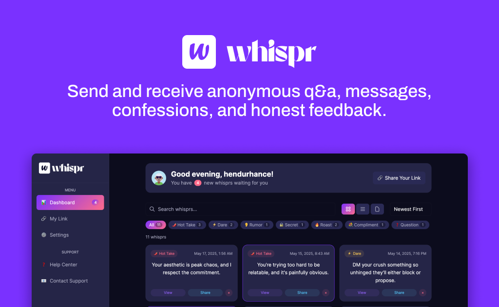

<div id="top"></div>

<div align="center">
  
  <h2>Whispr</h2>
  <p>The open-source way to collect anonymous questions, confessions, roasts and honest feedback. Share your link, find out what people really think, and turn the best replies into a share card.</p>
  <p>An open-source alternative to <b>NGL</b>, <b>Sarahah</b> and <b>Kubool</b>.</p>

  <p align="center">
    <a href="https://trywhispr.me">Live Demo</a>
    ·
    <a href="https://github.com/hendurhance/whispr/issues/new?assignees=&labels=bug&template=bug.yml&title=%5BBUG%5D+%3Cdescription%3E">Report Bug</a>
    ·
    <a href="https://github.com/hendurhance/whispr/issues/new?assignees=&labels=feature&template=features.yml&title=%5BFEATURE%5D+%3Cdescription%3E">Request Feature</a>
  </p>

  
  
  
   </br>
</div>

## What is Whispr?

Whispr is an open-source, privacy-first alternative to anonymous-messaging apps like NGL, Sarahah and Kubool. Claim a username, share one link (`trywhispr.me/<username>`), and anyone — no account needed — can send you anonymous questions, confessions, roasts, compliments or honest feedback. You read everything in a private inbox and answer the best ones by posting a printed-zine **share card** to your socials. No public comment wall, no fake metrics, no dark patterns.

## Features

- **Anonymous messages, nine ways** — questions, compliments, roasts, confessions, dares, secrets, hot takes, suggestions and rumors. Senders stay anonymous; you read it all in a private inbox.
- **One shareable link** — `trywhispr.me/<username>`, drop it in a bio or story.
- **Share cards (the viral loop)** — turn any whispr into an editorial share card (story / square / OG sizes) rendered server-side with `next/og`, with one-tap share to Instagram / TikTok / X, a QR code, and PNG download. There is **no in-app answering** — you reply by posting the card to your socials (the NGL model), so the link loops new senders back.
- **Near-real-time inbox** — the dashboard polls for new whisprs and surfaces them instantly, with filters by type and read/unread state.
- **Installable PWA** — add to home screen, offline fallback, app-icon unread badge, and **Web Push notifications** when a new whispr lands.
- **Dark mode** for the dashboard.
- **Passwordless login** — magic-link email, no passwords.
- **Random prompts** — a dice hands senders ready-made prompts when they're stuck.
- **Per-creator look** — accent "inks" and light/dark "paper" modes within the Ink & Riso design system.
- **Privacy & safety** — senders are anonymous to you and sender metadata is never exposed. Built-in abuse defense: server-side Zod validation, sliding-window rate limiting, a one-tap report flow, reserved-username enforcement, and an SEO/privacy `is_indexable` toggle.
- **SEO surface** — programmatic use-case / platform / comparison pages, a blog, and a copy-and-send prompts library.

## Design

Whispr ships a custom **"Ink & Riso"** editorial-risograph design system (brand colour **Klein Blue `#2433CC`**), split into two tiers: a loud **Press** tier for public and marketing surfaces, and a calm **Desk** tier for the authenticated app.

## Tech Stack

<table>
  <tr>
    <td align="center"><a href="https://nextjs.org/"><br /><sub><b>Next.js</b></sub></a><br /></td>
    <td align="center"><a href="https://reactjs.org/"><br /><sub><b>React</b></sub></a><br /></td>
    <td align="center"><a href="https://www.typescriptlang.org/"><br /><sub><b>TypeScript</b></sub></a><br /></td>
    <td align="center"><a href="https://www.supabase.io/"><br /><sub><b>Supabase</b></sub></a><br /></td>
    <td align="center"><a href="https://tailwindcss.com/"><br /><sub><b>Tailwind CSS</b></sub></a><br /></td>
    <td align="center"><a href="https://vercel.com/"><br /><sub><b>Vercel</b></sub></a><br /></td>
  </tr>
</table>

- **Next.js 16** — App Router, React Server Components, Turbopack, `next/og` and `next/image`.
- **React 19** + **TypeScript 5** (strict, zero `any`).
- **Tailwind CSS v4** — CSS-first `@theme` tokens, with **shadcn/ui** + **Radix** primitives.
- **Supabase** — Postgres + magic-link Auth + Row Level Security + `SECURITY DEFINER` RPCs + Deno **Edge Functions**.
- **Zod v4** for validation at every trust boundary, **GSAP** for motion, **qrcode.react** for QR.
- **Vercel** for hosting (automatic SSL + global CDN).

> **Why this stack?** Next.js gives us RSC, great SEO and a first-class image/OG pipeline; Supabase removes the need for a custom backend (auth, database, RLS and edge logic in one place); Tailwind v4's token system powers the two-tier design. The frontend uses a **lean shadcn-primitive + feature-component** model — no atomic-design explosion — so components stay few and strong.

## Getting Started

### Prerequisites

- **Git**, **Node.js 20+** (18.17+ works), and **npm**.
- A **Supabase** project — grab your project URL, anon key and functions URL.

### Installation

1. **Clone & install**
   ```sh
   git clone https://github.com/hendurhance/whispr.git
   cd whispr
   npm install
   ```

2. **Configure environment** — create `.env.local` in the root:
   ```sh
   NEXT_PUBLIC_APP_URL=http://localhost:3000
   NEXT_PUBLIC_SUPABASE_URL=<your_supabase_project_url>
   NEXT_PUBLIC_SUPABASE_ANON_KEY=<your_supabase_anon_key>
   NEXT_PUBLIC_SUPABASE_FUNCTIONS_URL=https://<project-ref>.supabase.co/functions/v1

   # optional
   NEXT_PUBLIC_VAPID_PUBLIC_KEY=<vapid_public_key> # Web Push (see below)
   NEXT_PUBLIC_GOOGLE_VERIFICATION=<gsc_token> # Google Search Console
   ```

3. **Set up the database** — in the Supabase **SQL Editor**, run every file in [`/migrations`](/migrations) **in order** (`001-init.sql` `007-web-push.sql`). They create the tables, RLS policies, RPCs and triggers (profiles, whisprs, social_links, weekly_stats, content_reports, rate_limit_hits, push_subscriptions, …).

4. **Deploy the Edge Functions** (in [`/supabase-fns`](/supabase-fns), via the Supabase CLI) — needed for production:
   - `submit-whispr` — anonymous submission with Zod validation + per-IP rate limiting (set `RATE_LIMIT_SALT`).
   - `send-push` — Web Push sender (set `VAPID_PUBLIC_KEY`, `VAPID_PRIVATE_KEY`, `VAPID_SUBJECT`).
   - `update-profile-views`, `update-whispr-count`, `delete-user`.

5. **Run the dev server**
   ```sh
   npm run dev
   ```
   Open <http://localhost:3000>.

6. **Create an account** — click **Sign in**, enter your email, and click the magic link. You'll be prompted to choose a username and set up your profile. Your link is `http://localhost:3000/<username>` locally (`trywhispr.me/<username>` in production).

7. **Test it** — open your link in an incognito window, send yourself a whispr, and watch it appear in your dashboard.

### Web Push (optional)

1. Generate keys: `npx web-push generate-vapid-keys`.
2. Set `NEXT_PUBLIC_VAPID_PUBLIC_KEY` in the app env, and `VAPID_PUBLIC_KEY` / `VAPID_PRIVATE_KEY` / `VAPID_SUBJECT` as secrets on the `send-push` function.
3. In Supabase **Database Webhooks**, create a hook on `whisprs` **INSERT** that calls the `send-push` Edge Function. Push then fires on every new whispr (and the inbox also updates via polling while open).

## Project structure

```
app/ # routes — (public) / (authenticated) / (marketing) groups, og/ image routes, robots & sitemap
components/ # ui (shadcn), dashboard, public-profile, landing, marketing, brand, pwa, ...
lib/ # next/og share-card renderers, client/server data, prompts & marketing & blog content
hooks/ # client-interaction hooks (no data fetching)
utils/ # supabase clients + Zod validation (source of truth)
configs/ # env config
migrations/ # 001–007 SQL — RLS, RPCs, triggers
supabase-fns/ # Deno Edge Functions
public/ # PWA manifest, service worker, icons, OG image
```

## Usage

You want honest, anonymous messages from your audience. Here's the flow:

1. **Get your link** — sign up and claim a username; your link (`trywhispr.me/alex`) shows on your dashboard.
2. **Share it** — post it in a bio or story: *"send me anything — anonymously."*
3. **People send** — anyone opening your link lands on your submission page. No login, no name. They pick a category, type a message, and send.
4. **You read & reply** — new whisprs land in your private inbox (unread-flagged, push-notified). Answer the good ones by turning them into a **share card** and posting it to your socials — the card carries your link, looping new senders back.
5. **You stay in control** — filter by type, mark read, delete, or report. Pause incoming messages or hide your profile from search anytime.

Anonymous to senders, private to you, with rate limiting and a report flow working behind the scenes to keep it safe.

## Contributing

Contributions of all kinds are welcome — bug fixes, features, docs. Please read the [contributing guidelines](/CONTRIBUTING.md) first. Some ways to help:

- **Report bugs** via the [issue tracker](https://github.com/hendurhance/whispr/issues) (include reproduction steps).
- **Request features** — open an issue to discuss, or send a PR.
- **Improve docs** — clearer docs help everyone.

By participating you agree to abide by our [Code of Conduct](/CODE_OF_CONDUCT.md).

## License

Distributed under the [AGPL-3.0 License](/LICENSE). You're free to use, modify and distribute this software; see the LICENSE file for the full text.

## Support

If Whispr is useful or fun, please:

- **Star** this repository to show your appreciation.
- **Share** Whispr with friends or on social media.
- **Sponsor** the maintainer — [GitHub Sponsors](https://github.com/sponsors/hendurhance) or [buy me a coffee](https://www.buymeacoffee.com/hendurhance).

<p align="right"><a href="#top">back to top</a></p>
