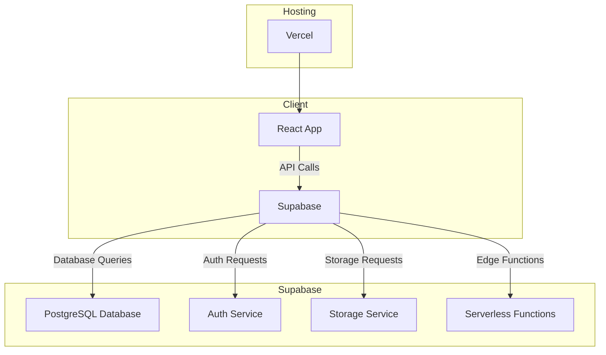
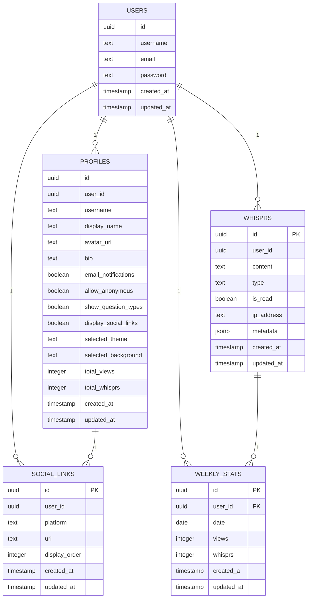
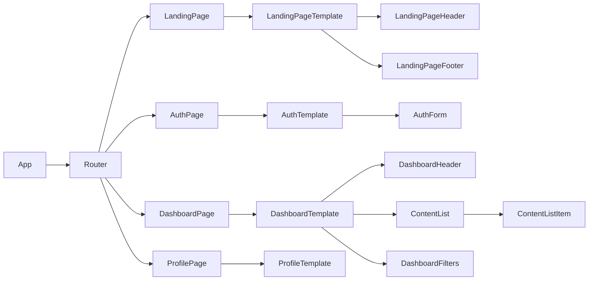

# Whispr Technical Specifications
This document provides a comprehensive technical overview of the Whispr application, covering its architecture, design decisions, data models, and other important technical details for developers and stakeholders.
## 💻 Tech Stack
<table>
  <tr>
    <td align="center"><a href="https://reactjs.org/"><br /><sub><b>React</b></sub></a><br /></td>
    <td align="center"><a href="https://www.typescriptlang.org/"><br /><sub><b>Typescript</b></sub></a><br /></td>
    <td align="center"><a href="https://www.supabase.io/"><br /><sub><b>Supabase</b></sub></a><br /></td>
    <td align="center"><a href="https://tailwindcss.com/"><br /><sub><b>Tailwind CSS</b></sub></a><br /></td>
    <td align="center"><a href="https://vercel.com/"><br /><sub><b>Vercel</b></sub></a><br /></td>
  </tr>
</table>

## System Architecture
Whispr follows a thin-client, monolithic front-end architecture. The entire application logic (aside from backend services provided by Supabase) resides on the client side (in the React app). There is no custom server for Whispr; instead, the front-end communicates directly with Supabase’s back-end services (database, authentication, storage) via Supabase’s JavaScript SDK and RESTful APIs. This approach was chosen to keep the system simple and fast to develop, given the project’s moderate scope.
Key elements of the architecture include:
- **Client**: A single-page React application (SPA) that implements all UI and client-side logic. It runs in the user’s browser, handling routing, state management, and calls to Supabase.
- **Backend-as-a-Service (BaaS)**: Supabase is used as the backend. Supabase provides:
a PostgreSQL database for storing all persistent data (user profiles and messages), Auth services for user sign-up/login (including magic link support), and Row-Level Security (RLS) policies to enforce data access rules in the database (ensuring users can only access their own data). Edge functions are used to handle server-side logic, such submitting whisprs, deleting users, and other operations that require server-side processing.
- **Hosting**: The front-end is deployed on Vercel, which serves the React app over HTTPS. This means the application can be accessed globally with low latency, and it can scale automatically to handle more users.
Below is a high-level diagram of Whispr’s system architecture:


**Monolithic Front-end Rationale:** Building the entire front-end as a single React application (rather than micro-frontends) keeps development straightforward and cohesive. Given Whispr’s size, the overhead of splitting into multiple front-end services isn’t justified – a monolithic SPA is easier to maintain and deploy. React was selected due to the team’s familiarity and its component-based architecture, which fits well with our design approach (Atomic Design). TypeScript adds reliability through static typing, catching errors early in development. This combination enables rapid iteration on features without managing complex multi-service interactions.

**Supabase Backend Rationale**: Using Supabase allowed the team to avoid writing a custom API server, significantly reducing development and maintenance effort. Supabase provides out-of-the-box solutions for user authentication (including OAuth providers and magic links) and integrates directly with a PostgreSQL database. Key benefits:
- **Fast Development**: No need to implement common backend features (auth, database CRUD, storage) from scratch – we use Supabase’s APIs.
- **Scalability**: Supabase is serverless and can scale to accommodate growing user base without major changes.
- **Security**: Supabase’s built-in security (RLS, auth token management) ensures robust protection of data without extensive custom code.
- **Simplicity**: Our data model is relatively simple (three main tables: Profiles, Whisprs, Weekly Stats and inbuilt Users table), so a lean BaaS is sufficient and efficient. A fully custom backend would be overkill for these needs

In summary, Whispr’s architecture is essentially a React client + Supabase backend, communicating over HTTPS. The client handles presentation and invoking backend operations; Supabase handles data persistence, auth, and file storage. This yields a clean separation: the front-end focuses on user experience, while backend concerns are abstracted by Supabase.

## 📱 Features and 👥 User Flows
This section outlines key user stories and how the system behaves for each. It describes the functional requirements from the end-user perspective, which also illustrate how different components work together behind the scenes.

### Landing Page
- **Public Landing View**: Unauthenticated users can access the landing page (home page) of Whispr, which provides an introduction to the service and its features
**Call to Action**: The landing page prominently shows options to Log In or Sign Up, encouraging new users to join. Clicking these buttons navigates to the authentication pages.
**Feature Highlights**: Visitors can scroll to see highlights of Whispr’s capabilities (e.g., how it works, privacy info, FAQs, contact links), giving them an overview before signing up
**Footer Links**: The landing page includes a footer with helpful links – such as the GitHub repository, a bug report link, and a contact email – for transparency and support.

### Account Creation & Login
- **Passwordless Signup**: Users can create an account with an email address using a magic link (passwordless login), which sends a link to their email for verification
- **Initial Profile Setup**: On first login, a new user is prompted to choose a username for their profile. This username will be used to generate their personal Whispr link (e.g., `trywhispr.me/alex)`. The app ensures usernames are unique.
- **Email Verification**: (If applicable) Users signing up via email may need to verify their email through the magic link for account activation, as per Supabase’s auth flow.
- **Login Sessions**:  Once registered, users can log in. Session tokens from Supabase keep the user logged in, with secure handling of credentials by Supabase (no passwords are stored in plaintext in our database).

### User Dashboard
- **Dashboard Access**: After logging in, users land on their Dashboard, which is a private page showing their profile and messages (whisprs).
- **Profile Information**: The dashboard displays the user’s profile picture (avatar), username, and their personal Whispr link for easy copying. For example: “Share your link: https://trywhispr.me/alex”.
- **Welcome Message**: The interface greets the user with a personalized message, e.g., “Good morning, Alex!”, which adds a friendly touch. This greeting may vary based on the time of day (morning/afternoon/evening).
- **No Messages State**: If the user has not received any whisprs yet (e.g., a brand new user), the dashboard shows an empty state message or illustration encouraging them to share their link and get some messages.
- **Whispr Feed**: If the user has received messages, the dashboard displays a list of all their whisprs. Users can toggle different view modes for this list – such as a grid of message cards, a chronological list, or a swipeable card view – depending on their preference. This is to improve readability and engagement with the messages.
- **Filtering**: Users can filter their incoming messages by category/type. For example, they can choose to view only Questions, only Compliments, only Confessions, etc., to focus on one type of whispr at a time.
- **Search**: A search bar is provided to allow the user to search within their messages by keywords or content. This is useful if they have many messages and want to find a specific one.
- **Sorting**: The user can sort the list of whisprs by date (received or sent) or by type. For instance, they might sort to see the newest messages first, or group messages by category.
- **Unread Indicators**: New incoming messages are marked as unread. The dashboard may show an unread count or highlight unread whisprs so the user can easily identify new ones.
- **Account Menu**: By clicking on their profile picture (or a dedicated settings icon), the user can access account management options. These include updating profile information, changing the avatar, copying or resetting their profile link, logging out, or even deleting their account if they wish.
- **Responsive Design**: The dashboard (and all pages) are mobile-responsive, so users can comfortably read and manage messages on smartphones as well as on desktop.

### Sending Anonymous Messages
- **Public Profile Pages**: Every user has a public-facing profile page at /<username> (for example, trywhispr.me/alex). This page is accessible to anyone with the link, without needing login. It serves as the message submission interface for that user.
- **Profile Header**: On a profile page, the target user’s name or display name is shown so the visitor knows whose “ask box” they are on (e.g., “Send a message to Alex”). There may also be the user’s avatar or a cover image.
- **Message Form**: Visitors can send an anonymous message via a form:
  - A text textarea or input field to type the message.
  - Category tabs or dropdown: The sender can pick a category for their message such as Question, Confession, Hot Takes, Dare, etc., to label the type of whispr.
  - Random Prompt Generator: An optional “🎲” dice button can generate a random question or prompt. This helps if the visitor doesn’t know what to ask – clicking it fills the message box with a randomly chosen question from a preset list.
- **Submitting a Message**: The visitor submits the form without providing any personal info – they do not need an account. When submitted, the message along with its metadata is sent to the database via the Supabase API. The sender sees a success confirmation (and perhaps a thank-you note).
- **Behind the Scenes**: When a message is submitted on /<username>:
  - The front-end resolves the username to a user ID (by querying the Users table or using a stored profile context) so it knows which account will own this message.
  - A new record is inserted into the `whisprs` table with the content of the message, the type (category) selected, and the owner_id set to the target user’s ID. The read status is defaulted to false (unread).
  - Simultaneously, a record is inserted or upsert in `weekly_stats` for analytics purposes, tracking the number of messages received by the user.
- **Sender Anonymity**: At no point does the sender have to reveal their identity. The message does not record the sender’s name or account (there is no concept of a sender account for anonymous submissions). The only data captured about the sender is technical metadata (IP, browser) which is encrypted and stored securely for moderation and security purposes, and is not shown to the recipient.

## Data Model and Storage
All application data is stored in a PostgreSQL database managed by Supabase. The schema is simple, consisting of three main tables: `profiles`, `whisprs`, `social_links` and `weekly_stats`. Supabase’s architecture automatically creates an auth.users table for authentication; our custom Users table links to those entries to store profile info like username.

## 📊 Database Schema
Since Whispr is built on Supabase, the database schema is based on Supabase's [PostgreSQL schema](https://supabase.com/docs/guides/database/overview)

### Tables
- **Users** - Stores each user’s profile information (one record per registered user).
- **Profiles** - Stores the public profile information of each user along with customization settings (one record per user).
- **Whisprs** - Stores the anonymous messages that users receive (one record per message).
- **Social Links** - Stores the social media links of each user (more than one record per user).
- **Weekly Stats** - Stores weekly statistics for each user, such as the number of messages received, the number of messages sent, and other analytics data.

These tables are related as follows: each User can have one Profile (they are the owner of that profile), each User can have many Whisprs (they are the recipient of those messages), and each user can have many Social Links (links to their social media profiles). The Profiles table is linked to the Users table, and the Weekly Stats table is linked to the Users table. The Whisprs table is linked to the Users table, and the Social Links table is linked to the Users table.

### ERD Diagram


### Table Descriptions
#### Users Table
| Column | Type | Description |
|--------|------|-------------|
| id | uuid | Unique identifier for each user (primary key). |
| username | text | Unique username chosen by the user. |
| email | text | User's email address (used for authentication). |
| password | text | User's password (hashed). |
| created_at | timestamp | Timestamp when the user was created. |
| updated_at | timestamp | Timestamp when the user was last updated. |
#### Profiles Table
| Column | Type | Description |
|--------|------|-------------|
| id | uuid | Unique identifier for each profile (primary key). |
| user_id | uuid | Foreign key referencing the Users table (one-to-one relationship). |
| username | text | Unique username chosen by the user. |
| display_name | text | Display name for the profile. |
| avatar_url | text | URL of the user's avatar image. |
| bio | text | Short biography or description of the user. |
| email_notifications | boolean | Flag indicating if the user wants to receive email notifications. |
| allow_anonymous | boolean | Flag indicating if the user allows anonymous messages. |
| show_question_types | boolean | Flag indicating if the user wants to show question types. |
| display_social_links | boolean | Flag indicating if the user wants to display social links. |
| selected_theme | text | Selected theme for the profile page. |
| selected_background | text | Selected background for the profile page. |
| total_views | integer | Total number of views for the profile page. |
| total_whisprs | integer | Total number of whisprs received by the user. |
| created_at | timestamp | Timestamp when the profile was created. |
| updated_at | timestamp | Timestamp when the profile was last updated. |
#### Whisprs Table
| Column | Type | Description |
|--------|------|-------------|
| id | uuid | Unique identifier for each whispr (primary key). |
| user_id | uuid | Foreign key referencing the Users table (many-to-one relationship). |
| content | text | Content of the whispr message. |
| type | text | Type of the whispr (e.g., question, compliment, confession). |
| is_read | boolean | Flag indicating if the whispr has been read by the user. |
| ip_address | text | IP address of the sender (for moderation purposes). |
| metadata | jsonb | Additional metadata about the whispr (e.g., browser info). |
| created_at | timestamp | Timestamp when the whispr was created. |
| updated_at | timestamp | Timestamp when the whispr was last updated. |
#### Social Links Table
| Column | Type | Description |
|--------|------|-------------|
| id | uuid | Unique identifier for each social link (primary key). |
| user_id | uuid | Foreign key referencing the Users table (many-to-one relationship). |
| platform | text | Name of the social media platform (e.g., Twitter, Instagram). |
| url | text | URL of the user's social media profile. |
| display_order | integer | Order in which the social links should be displayed. |
| created_at | timestamp | Timestamp when the social link was created. |
| updated_at | timestamp | Timestamp when the social link was last updated. |
#### Weekly Stats Table
| Column | Type | Description |
|--------|------|-------------|
| id | uuid | Unique identifier for each weekly stat (primary key). |
| user_id | uuid | Foreign key referencing the Users table (many-to-one relationship). |
| date | date | Date for the weekly stats (used for analytics). |
| views | integer | Number of views for the profile page on that date. |
| whisprs | integer | Number of whisprs received on that date. |
| created_at | timestamp | Timestamp when the weekly stat was created. |
| updated_at | timestamp | Timestamp when the weekly stat was last updated. |
### Relationships
- **Users to Profiles**: One-to-One
- **Users to Whisprs**: One-to-Many
- **Users to Social Links**: One-to-Many
- **Users to Weekly Stats**: One-to-Many

### Notes on Data Design:
- We keep user profile data separate from authentication data. The Users.id likely corresponds 1-1 with Supabase’s auth.users.id. By using Supabase Auth, we delegate password storage and verification to Supabase; we never store plaintext passwords in our tables (the password field might store a hash if we ever needed it, but currently we rely on external auth).
- The type field in Whisprs uses an enum, meaning the set of message categories is fixed in the database schema. This ensures data consistency (only allowed categories can be stored).
- We have minimal relational complexity: essentially, it’s a one-to-many from Users to Whisprs, and one-to-one (or one-to-many depending on viewpoint) from Users to Profiles. This keeps the data model simple and easy to query.
- The metadata field in Whisprs is a JSONB column, allowing us to store additional information about the message (e.g., IP address, browser info) without needing to create separate columns for each piece of data. This is useful for moderation and analytics purposes.
- The social_links table allows users to add multiple social media links, with a display order for how they should appear on their profile. This is a flexible way to manage user profiles without hardcoding link types.
- The weekly_stats table is designed to track user engagement over time. It allows us to analyze trends in message volume and profile views, which can inform future feature development and marketing strategies.
- The use of UUIDs as primary keys ensures that each record is globally unique, which is important for distributed systems and when using Supabase’s API.


## ⚡️ Authentication & Authorization
Whispr uses Supabase's [Auth](https://supabase.com/docs/guides/auth) to handle authentication. Supabase Auth provides a secure authentication system out of the box, with support for  passwordless authentication (magic link) with email, and more.
- **Auth Providers:** We enabled Email Magic Link login (passwordless) – when a user signs up with email, Supabase sends them a login link. This eliminates the need for passwords and improves security (no passwords to steal).
- **Supabase Auth Integration**: When a user signs in or signs up, Supabase handles the verification (OAuth token exchange or email verification) and returns a user object to our front-end. This user object contains a unique user ID (a UUID).
- **Users Table Sync**: We use a Users table in our database to store profile info (username, etc.). We link this to Supabase Auth by using the same UUID as the primary key. For example, after a new user signs up via Supabase, our front-end will prompt for a username and then insert a record into our Users table with id = auth.user.id to tie that profile to the auth record.
- **Session Management**: Supabase provides a session JWT for logged-in users, which the front-end SDK uses to authenticate future requests. We don’t manually handle tokens – the Supabase library does that for us, storing tokens in local storage and including them in API calls.
- **Authorization (RLS)**: We leverage Row Level Security policies in Supabase to enforce data access rules . RLS is enabled on the Whisprs tables so that:
  - A logged-in user can only select (read) their own messages from the Whisprs table. For example, a policy like owner_id = auth.uid() ensures user Alex can fetch only rows where owner_id = Alex’s user ID.
  - Only authorized actions are allowed. We can have policies to allow inserts into Whisprs by any user (even anonymous) as long as the owner_id corresponds to an existing user – this allows the public to send messages without being logged in. Meanwhile, reading from Whisprs requires auth and is restricted to owners.
  - Similar RLS rules apply to the Metadata table (e.g., perhaps only the service admin can read it, while insert is open or done via a secure function).
  - RLS on Users table might ensure users can only update their own profile, etc.
- **Security**: By using Supabase Auth and RLS, we ensure that even if someone manipulates the front-end, the backend will not return data that isn’t theirs, nor allow unauthorized actions. For example, a malicious party cannot download someone else’s messages or alter data, because the Supabase policies will block any request that doesn’t meet the criteria (the policies are enforced at the database level).
- **Password Management**: Since we allow passwordless email, we don’t handle passwords at all (no password column usage). If we ever enabled classic email/password sign-up, Supabase would handle hashing the password. Our system design avoids us ever seeing plaintext passwords, which is ideal for security. 
- **Account Data**: Users can update their own data (like change username or avatar) through the app, and such requests go through Supabase as authenticated updates to the Users table. We ensure via RLS that users can only update their own row.


## Frontend Architecture (Atomic Design)
Whispr’s front-end codebase is structured using the principles of Atomic Design. This methodology divides UI components into a hierarchy of complexity – from simple building blocks to complex pages – making the system scalable and maintainable. The component categories are:
## 📦 Architecture
Since Whispr is built on React, we leverage "Atomic Design" principles to build our components. In the Atomic Design Pattern, the project structure is organized into distinct levels or components, each serving a specific purpose. For this project, we will be using the following components:
- **Atoms**: The smallest and most basic components, analogous to HTML elements. These could be simple components like a button, an input field, a label, or an icon. They serve as the foundational building blocks that can’t be broken down further without losing functionality.
- **Molecules**: Slightly more complex components that are made up of multiple atoms working together. For example, a form input with a label and error message could be a molecule (combining label + input atom + perhaps an icon).
- **Organisms**: Larger sections of the UI formed by groups of molecules (and/or atoms). These are independent, relatively complex UI units. For instance, a navigation bar, a footer section, or a message list could be organisms composed of smaller parts.
- **Templates**: Page-level layout components that arrange organisms into a full page structure. A template defines the overall page skeleton (for example, a generic dashboard layout template that includes a header, a sidebar, and a content area, with slots where organisms will go).
- **Pages**: Specific instances of templates, with real content. A page is what the end-user actually sees as a route in the app – it fills a template with actual data and sub-components. For example, a “Dashboard Page” which uses the Dashboard template and populates it with the user’s actual data in organisms like the message list.
  
This structure is reflected in the project’s folder organization for the front-end code:

```
src/
├── atoms/            # Basic UI elements (reusable across app)
│   ├── Button.tsx
│   ├── Input.tsx
│   └── Avatar.tsx        # etc...
│
├── molecules/        # Small composite components
│   ├── SocialLoginButton.tsx   # Combines Icon + Button (uses atoms)
│   ├── AuthForm.tsx            # A form composed of inputs, buttons
│   └── ContentListItem.tsx     # Perhaps a card or list element molecule
│
├── organisms/        # Larger composites and sections
│   ├── LandingPageHeader.tsx
│   ├── LandingPageFooter.tsx
│   ├── AuthPage.tsx
│   ├── ProfileSettings.tsx
│   ├── DashboardHeader.tsx
│   ├── ContentList.tsx        # List of messages, uses ContentListItem
│   ├── DashboardFilters.tsx
│   ├── MessageDisplay.tsx
│   └── MessagesFilters.tsx   # etc...
│
├── templates/        # Page layouts
│   ├── DefaultTemplate.tsx    # Generic layout (header, footer, content area)
│   ├── LandingPageTemplate.tsx
│   ├── AuthTemplate.tsx
│   ├── DashboardTemplate.tsx
│   └── ... (one template per major page section)
│
├── pages/            # Specific pages (routes)
│   ├── LandingPage.tsx        # Uses LandingPageTemplate and fills content
│   ├── LoginPage.tsx          # Possibly uses AuthTemplate
│   ├── SignupPage.tsx         # Uses AuthTemplate as well
│   ├── ProfilePage.tsx        # Uses Profile template
│   ├── DashboardPage.tsx      # Uses DashboardTemplate
│   └── MessagesPage.tsx       # Perhaps for viewing a single message or messages section
│
├── services/         # Modules for API calls or external interactions
│   └── supabaseClient.ts      # e.g., configuration of Supabase connection
│   └── ... (any other API helpers)
│
├── utils/            # Utility functions (e.g., formatting dates, generating random prompts)
│   └── constants.ts, helpers.ts, etc.
│
├── styles/           # Global styles or Tailwind config (if any separate files)
│   └── index.css, etc.
│
├── App.tsx           # React root component – configures Routes, layouts
└── index.tsx         # Application entry point (ReactDOM render)
```
(In the above, filenames are illustrative. The actual implementation might organize them slightly differently or have additional files, but the overall structure follows this Atomic hierarchy.)
The benefit of this architecture is that it imposes a clear separation of concerns:- 
- When adding a very simple element, you add an Atom.
- When that element needs to be used with another in tandem, you combine them in a Molecule.
- Complex UI sections on a page become Organisms, which keep related elements together (for example, a “Message List” organism encapsulates the logic for paginating and displaying multiple messages).
- **Templates** ensure consistency across pages (e.g., all pages might share a header and footer, defined once in a DefaultTemplate).
- This makes the UI scalable: as new features are added, developers can decide at which level a new component should be introduced, rather than piling all logic in large components.

We also maintain a hierarchy in our React component rendering:
- The main App sets up routing. Based on the URL, it loads a specific Page component (e.g., DashboardPage).
- Page components apply a Template and populate it with Organisms and Molecules as needed.
- Within those, smaller Molecules and Atoms are used. State and props flow down this tree.
- For example: `App -> DashboardPage -> DashboardTemplate (which includes Header, Sidebar, Content area) -> DashboardHeader (organism), ContentList (organism) -> ContentListItem (molecule) -> Button, Text, etc. (atoms)`.

We can visualize a portion of the component hierarchy in a simplified form:


(Above is just an example; actual components may differ, but this shows how pages break down into templates and then into sections.)
## Conclusion
The Atomic Design pattern provides a clear, scalable way to structure the Whispr front-end codebase. By organizing components into a hierarchy of Atoms, Molecules, Organisms, Templates, and Pages, we ensure that the application is maintainable and easy to extend as new features are added. This approach also promotes reusability and consistency across the UI, making it easier for developers to work collaboratively on the project.
## Future Improvements
- **Component Library**: As the project grows, we may consider creating a shared component library for reusable components across different projects.
- **Testing**: Implementing unit tests for components and integration tests for user flows to ensure reliability and catch regressions.
- **Performance Optimization**: Continuously monitoring and optimizing the performance of components, especially those that handle large data sets or complex rendering.
- **Accessibility**: Ensuring all components are accessible and meet WCAG standards for users with disabilities.
- **Documentation**: Maintaining clear documentation for each component, including usage examples and props descriptions, to help future developers understand the codebase quickly.
- **Design System**: As the project matures, we may consider creating a design system that includes guidelines for component usage, design tokens, and best practices for building new components. This would help maintain consistency and improve collaboration between designers and developers.
- **State Management**: As the application grows, we may need to implement a more robust state management solution (e.g., Redux, Zustand) to handle complex state interactions and improve performance.
- **Internationalization**: If we plan to support multiple languages, we may need to implement internationalization (i18n) for the application, allowing users to switch between languages easily.

## References
- [Andela's Atomic Design Pattern](https://andela.com/blog-posts/structuring-your-react-application-atomic-design-principles)
- [BootcampCoffeeIsTheKey](https://bootcamp.uxdesign.cc/from-atoms-to-pages-implementing-atomic-design-in-react-2c91d1031e7c)
- [Google references](https://www.google.com/search?q=react+atomic+design+pattern)
