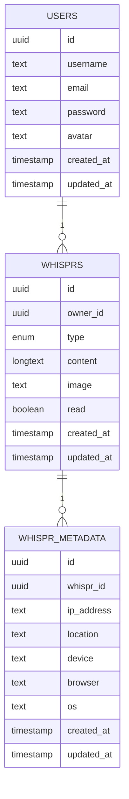
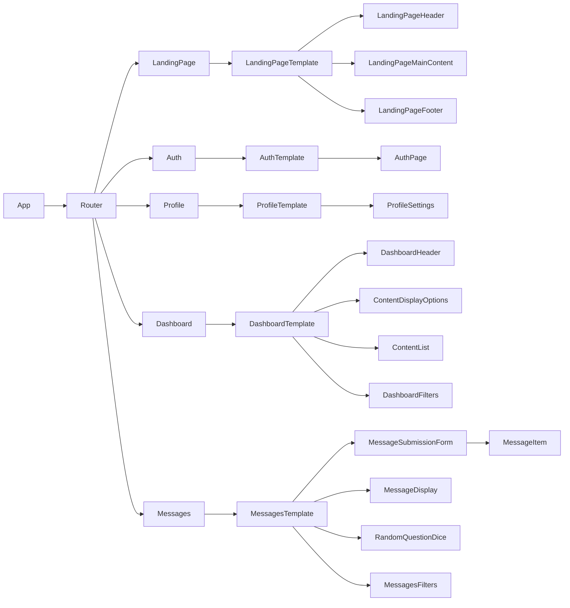
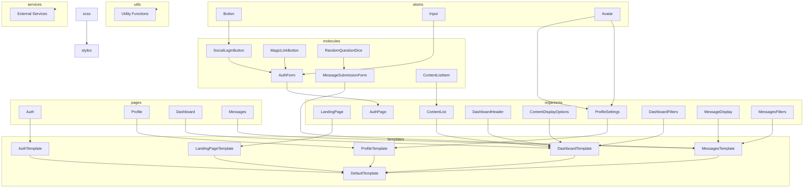

# Whispr Technical Specifications

## 💻 Tech Stack
<table>
  <tr>
    <td align="center"><a href="https://reactjs.org/"><br /><sub><b>React</b></sub></a><br /></td>
    <td align="center"><a href="https://www.typescriptlang.org/"><br /><sub><b>Typescript</b></sub></a><br /></td>
    <td align="center"><a href="https://www.supabase.io/"><br /><sub><b>Supabase</b></sub></a><br /></td>
    <td align="center"><a href="https://tailwindcss.com/"><br /><sub><b>Tailwind CSS</b></sub></a><br /></td>
    <td align="center"><a href="https://vercel.com/"><br /><sub><b>Vercel</b></sub></a><br /></td>
  </tr>
</table>

### Frontend
- **React** - Frontend framework
- **Typescript** - Programming language
- **Supabase** - Backend as a service
- **Tailwind CSS** - CSS framework
- **Vercel** - Hosting

## 👥 User Stories
#### Landing Page
- [ ] Users can view the landing page
- [ ] Users can view the features of the app
- [ ] Users can see login and signup buttons
- [ ] Users can click on login and signup buttons to be redirected to the login and signup pages respectively
- [ ] Users can view the footer with links to the GitHub repo, Report a Bug, and Contact Us
#### Account Creation
- [ ] Users can create an account using social login (Google, Facebook, Twitter, GitHub, GitLab, Bitbucket)
- [ ] Users can create an account using passwordless authentication (magic link) with email
- [ ] Upon the first login, users are prompted to create a username, which will be associated with a personal link (e.g. trywhispr.me/username or trywhispr.vercel.app/username)
#### Dashboard
- [ ] Users can view their dashboard after logging in
- [ ] Users can view their profile picture, username, and their personalized link
- [ ] Users should get see a welcome message on the dashboard header greeting them by their username like Good {time of day}, {username}".
- [ ] When users click on their profile picture, they can manage their account settings like changing their information, deleting their account, logging out, etc.
- [ ] Upon login for new users without no anonymous whisprs, empty state is shown
- [ ] For users with existing Q&A, confessions, etc, the dashboard lists items that can be arranged in grid, list, or swipe card view depending on user preference
- [ ] Users can view the number of whisprs received
- [ ] Users can see the different types of whisprs they have received (Q&A, confessions, compliments, etc) and filter by type of whispr
- [ ] User should be able to search for whispr by its content
- [ ] Users should be able to sort whisprs by date received, date sent, and type of whispr

#### Anonymous Messaging
- [ ] Anonymous messaging can be sent to a user's personalized link (e.g. trywhispr.me/username or trywhispr.vercel.app/username)
- [ ] Submission screen displays the owner's name, category tabs, and an option to add an image.
- [ ] Users can select a category tab to send a specific type of whispr (Q&A, confessions, compliments, etc)
- [ ] Submission screen should allow image upload to make the whispr more personal
- [ ] User can use the dice icon to generate a random whispr from a list of pre-written whisprs
- [ ] Users can submit messages, which are then stored with associated metadata (owner, image, message type). 


## 📊 Database Schema
Since Whispr is built on Supabase, the database schema is based on Supabase's [PostgreSQL schema](https://supabase.com/docs/guides/database/overview)

### Tables
- **Users** - Stores user information
- **Whisprs** - Stores whispr information
- **Whispr Metadata** - Stores whispr metadata

#### Users Table
| Column Name | Data Type | Description |
| ----------- | --------- | ----------- |
| id | uuid | Unique identifier for each user |
| username | text | User's username |
| email | text | User's email |
| password | text | User's password |
| avatar | text | User's profile picture |
| created_at | timestamp | Timestamp of when user was created |
| updated_at | timestamp | Timestamp of when user was last updated |

#

#### Whisprs Table
| Column Name | Data Type | Description |
| ----------- | --------- | ----------- |
| id | uuid | Unique identifier for each whispr |
| owner_id | uuid | Unique identifier for each user |
| type | enum | Type of whispr (Q&A, confessions, compliments, etc) |
| content | longtext | Content of whispr |
| image | text | Image associated with whispr |
| read | boolean | Whether or not whispr has been read |
| created_at | timestamp | Timestamp of when whispr was created |
| updated_at | timestamp | Timestamp of when whispr was last updated |

#### Whispr Metadata Table
| Column Name | Data Type | Description |
| ----------- | --------- | ----------- |
| id | uuid | Unique identifier for each whispr metadata |
| whispr_id | uuid | Unique identifier for each whispr |
| ip_address | text | IP address of whispr sender encrypted with AES-256 |
| location | text | Location of whispr sender |
| device | text | Device of whispr sender |
| browser | text | Browser of whispr sender |
| os | text | Operating system of whispr sender |
| created_at | timestamp | Timestamp of when whispr metadata was created |
| updated_at | timestamp | Timestamp of when whispr metadata was last updated |


### Database Schema Diagram


## ⚡️ Authentication & Authorization
Whispr uses Supabase's [Auth](https://supabase.com/docs/guides/auth) to handle authentication. Supabase Auth provides a secure authentication system out of the box, with support for social login providers (Google, Facebook, Twitter, GitHub, GitLab, Bitbucket), passwordless authentication (magic link) with email, and more. We leverage Supabase RLS (Row Level Security) to handle authorization. RLS allows us to restrict access to data based on the user that is logged in. For example, a user can only view their own whisprs and not other users' whisprs.

## 📷 Storage
Whispr uses Supabase's [Storage](https://supabase.com/docs/guides/storage) to handle storage. All whispr with an image will be stored in Supabase Storage. Note: Avatars for each users will be handled by third-party providers (DiceBear, Boring Avatars, etc).

## 📦 Architecture
Since Whispr is built on React, we leverage "Atomic Design" principles to build our components. In the Atomic Design Pattern, the project structure is organized into distinct levels or components, each serving a specific purpose. For this project, we will be using the following components:
- **Atoms** - The smallest components that represent basic HTML elements like form labels, inputs, buttons, and others that can’t be broken down any further without ceasing to be functional.
- **Molecules** - Molecules are the composition of one or more atoms. They represent the smallest fundamental units of a compound component.
- **Organisms** - Organisms are the combination of molecules that work together or even with atoms that compose more elaborate interfaces.
- **Templates** - Templates are page-level objects that place components into a layout and articulate the design’s underlying content structure.
- **Pages** - Pages are specific instances of templates that show what a UI looks like with real representative content in place.
- **Layouts** - Layouts are the arrangement of our pages into a container, grid, or columns. They hold the pages together and provide a framework for designing the various parts of the website.

### Folder Structure
```
src
|-- atoms
|   |-- (individual UI elements such as buttons, inputs, etc.)
|
|-- molecules
|   |-- (small components made up of atoms)
|
|-- organisms
|   |-- LandingPage
|       |-- LandingPageHeader (molecule)
|       |-- LandingPageMainContent (molecule)
|       |-- LandingPageFooter (molecule)
|
|   |-- Auth
|       |-- SocialLoginButton (atom)
|       |-- MagicLinkButton (atom)
|       |-- AuthForm (molecule)
|       |-- AuthPage (organism)
|
|   |-- Profile
|       |-- Avatar (atom)
|       |-- ProfileForm (molecule)
|       |-- ProfileSettings (organism)
|
|   |-- Dashboard
|       |-- DashboardHeader (molecule)
|       |-- ContentDisplayOptions (molecule)
|       |-- ContentList (organism)
|           |-- ContentListItem (molecule)
|       |-- DashboardFilters (organism)
|
|   |-- Messages
|       |-- MessageSubmissionForm (molecule)
|       |-- MessageDisplay (organism)
|           |-- MessageItem (molecule)
|       |-- RandomQuestionDice (atom)
|       |-- MessagesFilters (organism)
|
|-- templates
|   |-- DefaultTemplate
|       |-- Header (organism)
|       |-- Footer (organism)
|       |-- MainContent (organism)
|
|-- pages
|   |-- LandingPage
|       |-- LandingPageTemplate (template)
|   |-- Auth
|       |-- AuthTemplate (template)
|   |-- Profile
|       |-- ProfileTemplate (template)
|   |-- Dashboard
|       |-- DashboardTemplate (template)
|   |-- Messages
|       |-- MessagesTemplate (template)
|
|-- utils
|   |-- (utility functions and helper modules)
|
|-- services
|   |-- (modules responsible for interfacing with external services, APIs, or backend functionalities)
|
|-- styles
|   |-- (style-related files, such as SCSS files)
|-- App.tsx
|-- index.tsx
```

### Component Hierarchy

### Architecture Diagram

### References
- [Andela's Atomic Design Pattern](https://andela.com/blog-posts/structuring-your-react-application-atomic-design-principles)
- [BootcampCoffeeIsTheKey](https://bootcamp.uxdesign.cc/from-atoms-to-pages-implementing-atomic-design-in-react-2c91d1031e7c)
- [Google references](https://www.google.com/search?q=react+atomic+design+pattern)
