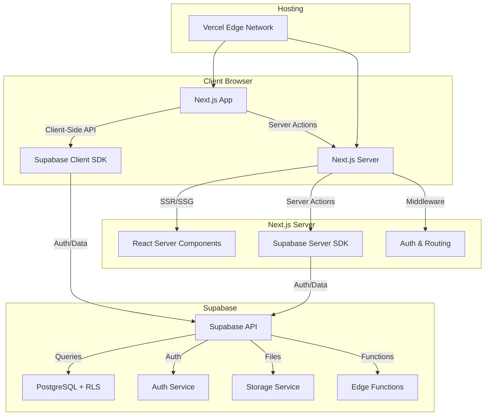
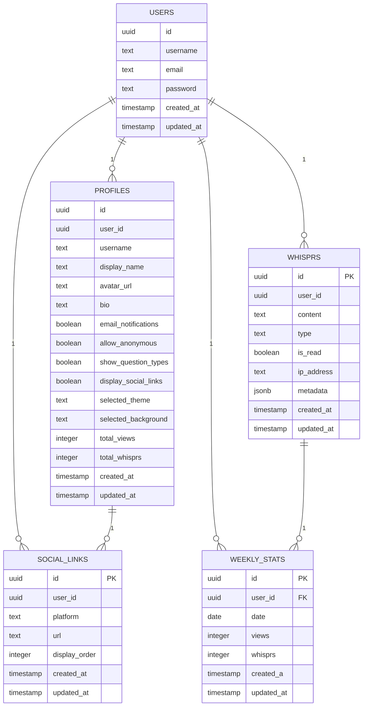
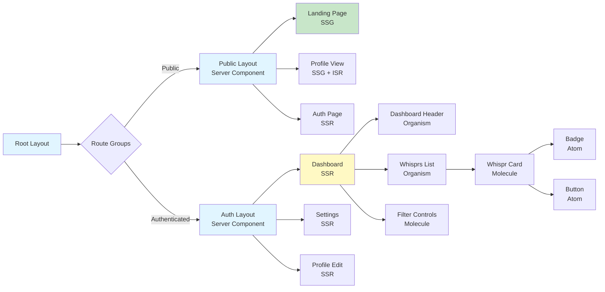

# Whispr Technical Specifications
This document provides a comprehensive technical overview of the Whispr application, covering its architecture, design decisions, data models, and other important technical details for developers and stakeholders.

## 💻 Tech Stack
<table>
  <tr>
    <td align="center"><a href="https://nextjs.org/"><br /><sub><b>Next.js</b></sub></a><br /></td>
    <td align="center"><a href="https://reactjs.org/"><br /><sub><b>React</b></sub></a><br /></td>
    <td align="center"><a href="https://www.typescriptlang.org/"><br /><sub><b>TypeScript</b></sub></a><br /></td>
    <td align="center"><a href="https://www.supabase.io/"><br /><sub><b>Supabase</b></sub></a><br /></td>
    <td align="center"><a href="https://tailwindcss.com/"><br /><sub><b>Tailwind CSS</b></sub></a><br /></td>
    <td align="center"><a href="https://vercel.com/"><br /><sub><b>Vercel</b></sub></a><br /></td>
  </tr>
</table>

## System Architecture
Whispr is built with Next.js 15, leveraging the modern App Router architecture with Server Components, Server Actions, and Client Components. The application follows a hybrid rendering strategy, utilizing Server-Side Rendering (SSR) for dynamic pages, Static Site Generation (SSG) for public pages, and Client-Side Rendering where interactive features are needed. There is no custom backend server; instead, Next.js Server Actions and API routes communicate directly with Supabase's backend services (database, authentication, storage) via the `@supabase/ssr` SDK.

Key elements of the architecture include:

- **Next.js App Router**: Modern file-based routing with support for layouts, loading states, error boundaries, and streaming. Uses the `app/` directory structure with clear separation between public `(public)` and authenticated `(authenticated)` route groups.

- **Server Components (RSC)**: Default rendering mode for most components, allowing server-side data fetching and reducing client-side JavaScript. Provides faster initial page loads, better SEO, and improved performance.

- **Client Components**: Used for interactive features requiring browser APIs, state management, or event handlers. Marked with `'use client'` directive and strategically placed to minimize client-side JavaScript bundle.

- **Server Actions**: Type-safe server-side functions callable from both Server and Client Components, replacing traditional API routes for mutations. Provides seamless form handling and data updates.

- **Backend-as-a-Service (BaaS)**: Supabase provides:
  - PostgreSQL database for all persistent data (profiles, messages, social links, stats)
  - Auth services with magic link support and Row-Level Security (RLS)
  - Storage for user avatars and media files
  - Edge functions for custom server-side operations
  - Real-time subscriptions for live updates

- **Hosting**: Deployed on Vercel, which provides:
  - Global Edge Network for low latency worldwide
  - Automatic SSL certificates and HTTPS
  - Serverless Functions for API routes
  - Incremental Static Regeneration (ISR) support
  - Preview deployments for pull requests
  - Analytics and monitoring

Below is a high-level diagram of Whispr's system architecture:


``` mermaid
graph TD
  subgraph Client Browser
    A[Next.js App] -->|Server Actions| B[Next.js Server]
    A -->|Client-Side API| C[Supabase Client SDK]
  end

  subgraph Next.js Server
    B -->|SSR/SSG| D[React Server Components]
    B -->|Server Actions| E[Supabase Server SDK]
    B -->|Middleware| F[Auth & Routing]
  end

  subgraph Supabase
    C -->|Auth/Data| G[Supabase API]
    E -->|Auth/Data| G
    G -->|Queries| H[PostgreSQL + RLS]
    G -->|Auth| I[Auth Service]
    G -->|Files| J[Storage Service]
    G -->|Functions| K[Edge Functions]
  end

  subgraph Hosting
    L[Vercel Edge Network] --> A
    L --> B
  end
```

**Next.js App Router Rationale:** The App Router provides significant advantages:
- **Server Components by default**: Reduces client-side JavaScript bundle size and improves performance by rendering on the server
- **Streaming & Suspense**: Progressive rendering for faster perceived performance and better user experience
- **Layouts**: Shared layouts that persist across navigation without re-rendering
- **Server Actions**: Type-safe server mutations without building separate API endpoints
- **Better SEO**: Built-in metadata API and server-side rendering for optimal search engine indexing
- **Colocation**: Components, tests, and utilities can be organized together in feature folders
- **Enhanced Security**: Sensitive operations execute server-side, never exposing credentials to the client

**Hybrid Rendering Strategy:**
- **Public pages** (landing, profile viewing): Static Site Generation (SSG) with Incremental Static Regeneration (ISR) for fresh content
- **Authenticated pages** (dashboard, settings): Server-Side Rendering (SSR) for personalized, real-time data
- **Interactive components**: Client Components for forms, filters, modals, and real-time interactions
- **API Routes & Server Actions**: Server-side operations for data mutations and complex business logic

**Supabase Backend Rationale**: Using Supabase provides key benefits:
- **Fast Development**: Pre-built authentication, database, and storage solutions eliminate boilerplate
- **Type Safety**: Generated TypeScript types from database schema ensure compile-time safety
- **Real-time**: Built-in real-time subscriptions for live updates without WebSocket management
- **Security**: Row-Level Security (RLS) policies enforce data access at the database level
- **Scalability**: Serverless architecture scales automatically with user growth
- **SSR Integration**: `@supabase/ssr` package provides optimized cookie-based auth for Next.js

In summary, Whispr's architecture leverages Next.js for optimal rendering strategies (SSR/SSG/CSR) + Supabase for backend services, all hosted on Vercel's edge network. This yields excellent performance, security, SEO, and developer experience while maintaining simplicity and scalability.

## 📱 Features and 👥 User Flows
This section outlines key user stories and how the system behaves for each. It describes the functional requirements from the end-user perspective, which also illustrate how different components work together behind the scenes.

### Landing Page
- **Public Landing View**: Unauthenticated users can access the landing page (home page) of Whispr, which provides an introduction to the service and its features
**Call to Action**: The landing page prominently shows options to Log In or Sign Up, encouraging new users to join. Clicking these buttons navigates to the authentication pages.
**Feature Highlights**: Visitors can scroll to see highlights of Whispr’s capabilities (e.g., how it works, privacy info, FAQs, contact links), giving them an overview before signing up
**Footer Links**: The landing page includes a footer with helpful links – such as the GitHub repository, a bug report link, and a contact email – for transparency and support.

### Account Creation & Login
- **Passwordless Signup**: Users can create an account with an email address using a magic link (passwordless login), which sends a link to their email for verification
- **Initial Profile Setup**: On first login, a new user is prompted to choose a username for their profile. This username will be used to generate their personal Whispr link (e.g., `trywhispr.me/alex)`. The app ensures usernames are unique.
- **Email Verification**: (If applicable) Users signing up via email may need to verify their email through the magic link for account activation, as per Supabase’s auth flow.
- **Login Sessions**:  Once registered, users can log in. Session tokens from Supabase keep the user logged in, with secure handling of credentials by Supabase (no passwords are stored in plaintext in our database).

### User Dashboard
- **Dashboard Access**: After logging in, users land on their Dashboard, which is a private page showing their profile and messages (whisprs).
- **Profile Information**: The dashboard displays the user’s profile picture (avatar), username, and their personal Whispr link for easy copying. For example: “Share your link: https://trywhispr.me/alex”.
- **Welcome Message**: The interface greets the user with a personalized message, e.g., “Good morning, Alex!”, which adds a friendly touch. This greeting may vary based on the time of day (morning/afternoon/evening).
- **No Messages State**: If the user has not received any whisprs yet (e.g., a brand new user), the dashboard shows an empty state message or illustration encouraging them to share their link and get some messages.
- **Whispr Feed**: If the user has received messages, the dashboard displays a list of all their whisprs. Users can toggle different view modes for this list – such as a grid of message cards, a chronological list, or a swipeable card view – depending on their preference. This is to improve readability and engagement with the messages.
- **Filtering**: Users can filter their incoming messages by category/type. For example, they can choose to view only Questions, only Compliments, only Confessions, etc., to focus on one type of whispr at a time.
- **Search**: A search bar is provided to allow the user to search within their messages by keywords or content. This is useful if they have many messages and want to find a specific one.
- **Sorting**: The user can sort the list of whisprs by date (received or sent) or by type. For instance, they might sort to see the newest messages first, or group messages by category.
- **Unread Indicators**: New incoming messages are marked as unread. The dashboard may show an unread count or highlight unread whisprs so the user can easily identify new ones.
- **Account Menu**: By clicking on their profile picture (or a dedicated settings icon), the user can access account management options. These include updating profile information, changing the avatar, copying or resetting their profile link, logging out, or even deleting their account if they wish.
- **Responsive Design**: The dashboard (and all pages) are mobile-responsive, so users can comfortably read and manage messages on smartphones as well as on desktop.

### Sending Anonymous Messages
- **Public Profile Pages**: Every user has a public-facing profile page at /<username> (for example, trywhispr.me/alex). This page is accessible to anyone with the link, without needing login. It serves as the message submission interface for that user.
- **Profile Header**: On a profile page, the target user’s name or display name is shown so the visitor knows whose “ask box” they are on (e.g., “Send a message to Alex”). There may also be the user’s avatar or a cover image.
- **Message Form**: Visitors can send an anonymous message via a form:
  - A text textarea or input field to type the message.
  - Category tabs or dropdown: The sender can pick a category for their message such as Question, Confession, Hot Takes, Dare, etc., to label the type of whispr.
  - Random Prompt Generator: An optional “🎲” dice button can generate a random question or prompt. This helps if the visitor doesn’t know what to ask – clicking it fills the message box with a randomly chosen question from a preset list.
- **Submitting a Message**: The visitor submits the form without providing any personal info – they do not need an account. When submitted, the message along with its metadata is sent to the database via the Supabase API. The sender sees a success confirmation (and perhaps a thank-you note).
- **Behind the Scenes**: When a message is submitted on /<username>:
  - The front-end resolves the username to a user ID (by querying the Users table or using a stored profile context) so it knows which account will own this message.
  - A new record is inserted into the `whisprs` table with the content of the message, the type (category) selected, and the owner_id set to the target user’s ID. The read status is defaulted to false (unread).
  - Simultaneously, a record is inserted or upsert in `weekly_stats` for analytics purposes, tracking the number of messages received by the user.
- **Sender Anonymity**: At no point does the sender have to reveal their identity. The message does not record the sender’s name or account (there is no concept of a sender account for anonymous submissions). The only data captured about the sender is technical metadata (IP, browser) which is encrypted and stored securely for moderation and security purposes, and is not shown to the recipient.

## Data Model and Storage
All application data is stored in a PostgreSQL database managed by Supabase. The schema is simple, consisting of three main tables: `profiles`, `whisprs`, `social_links` and `weekly_stats`. Supabase’s architecture automatically creates an auth.users table for authentication; our custom Users table links to those entries to store profile info like username.

## 📊 Database Schema
Since Whispr is built on Supabase, the database schema is based on Supabase's [PostgreSQL schema](https://supabase.com/docs/guides/database/overview)

### Tables
- **Users** - Stores each user’s profile information (one record per registered user).
- **Profiles** - Stores the public profile information of each user along with customization settings (one record per user).
- **Whisprs** - Stores the anonymous messages that users receive (one record per message).
- **Social Links** - Stores the social media links of each user (more than one record per user).
- **Weekly Stats** - Stores weekly statistics for each user, such as the number of messages received, the number of messages sent, and other analytics data.

These tables are related as follows: each User can have one Profile (they are the owner of that profile), each User can have many Whisprs (they are the recipient of those messages), and each user can have many Social Links (links to their social media profiles). The Profiles table is linked to the Users table, and the Weekly Stats table is linked to the Users table. The Whisprs table is linked to the Users table, and the Social Links table is linked to the Users table.

### ERD Diagram

``` mermaid
erDiagram
    USERS ||--o{ PROFILES : "1" 
    USERS ||--o{ WHISPRS : "1" 
    USERS ||--o{ SOCIAL_LINKS : "1" 
    USERS ||--o{ WEEKLY_STATS : "1" 
    PROFILES ||--o{ SOCIAL_LINKS : "1" 
    WHISPRS ||--o{ WEEKLY_STATS : "1" 
    USERS {
        uuid id
        text username
        text email
        text password
        timestamp created_at
        timestamp updated_at
    }
    PROFILES {
        uuid id
        uuid user_id
        text username
        text display_name
        text avatar_url
        text bio
        boolean email_notifications
        boolean allow_anonymous
        boolean show_question_types
        boolean display_social_links
        text selected_theme
        text selected_background
        integer total_views
        integer total_whisprs
        timestamp created_at
        timestamp updated_at
    }
    WHISPRS {
      uuid id PK
      uuid user_id
      text content
      text type
      boolean is_read
      text ip_address
      jsonb metadata
      timestamp created_at
      timestamp updated_at
    }
    SOCIAL_LINKS {
        uuid id PK
        uuid user_id
        text platform
        text url
        integer display_order
        timestamp created_at
        timestamp updated_at
    }
    WEEKLY_STATS {
      uuid id PK
      uuid user_id FK
      date date
      integer views
      integer whisprs
      timestamp created_a
      timestamp updated_at
    }
```

### Table Descriptions
#### Users Table
| Column | Type | Description |
|--------|------|-------------|
| id | uuid | Unique identifier for each user (primary key). |
| username | text | Unique username chosen by the user. |
| email | text | User's email address (used for authentication). |
| password | text | User's password (hashed). |
| created_at | timestamp | Timestamp when the user was created. |
| updated_at | timestamp | Timestamp when the user was last updated. |
#### Profiles Table
| Column | Type | Description |
|--------|------|-------------|
| id | uuid | Unique identifier for each profile (primary key). |
| user_id | uuid | Foreign key referencing the Users table (one-to-one relationship). |
| username | text | Unique username chosen by the user. |
| display_name | text | Display name for the profile. |
| avatar_url | text | URL of the user's avatar image. |
| bio | text | Short biography or description of the user. |
| email_notifications | boolean | Flag indicating if the user wants to receive email notifications. |
| allow_anonymous | boolean | Flag indicating if the user allows anonymous messages. |
| show_question_types | boolean | Flag indicating if the user wants to show question types. |
| display_social_links | boolean | Flag indicating if the user wants to display social links. |
| selected_theme | text | Selected theme for the profile page. |
| selected_background | text | Selected background for the profile page. |
| total_views | integer | Total number of views for the profile page. |
| total_whisprs | integer | Total number of whisprs received by the user. |
| created_at | timestamp | Timestamp when the profile was created. |
| updated_at | timestamp | Timestamp when the profile was last updated. |
#### Whisprs Table
| Column | Type | Description |
|--------|------|-------------|
| id | uuid | Unique identifier for each whispr (primary key). |
| user_id | uuid | Foreign key referencing the Users table (many-to-one relationship). |
| content | text | Content of the whispr message. |
| type | text | Type of the whispr (e.g., question, compliment, confession). |
| is_read | boolean | Flag indicating if the whispr has been read by the user. |
| ip_address | text | IP address of the sender (for moderation purposes). |
| metadata | jsonb | Additional metadata about the whispr (e.g., browser info). |
| created_at | timestamp | Timestamp when the whispr was created. |
| updated_at | timestamp | Timestamp when the whispr was last updated. |
#### Social Links Table
| Column | Type | Description |
|--------|------|-------------|
| id | uuid | Unique identifier for each social link (primary key). |
| user_id | uuid | Foreign key referencing the Users table (many-to-one relationship). |
| platform | text | Name of the social media platform (e.g., Twitter, Instagram). |
| url | text | URL of the user's social media profile. |
| display_order | integer | Order in which the social links should be displayed. |
| created_at | timestamp | Timestamp when the social link was created. |
| updated_at | timestamp | Timestamp when the social link was last updated. |
#### Weekly Stats Table
| Column | Type | Description |
|--------|------|-------------|
| id | uuid | Unique identifier for each weekly stat (primary key). |
| user_id | uuid | Foreign key referencing the Users table (many-to-one relationship). |
| date | date | Date for the weekly stats (used for analytics). |
| views | integer | Number of views for the profile page on that date. |
| whisprs | integer | Number of whisprs received on that date. |
| created_at | timestamp | Timestamp when the weekly stat was created. |
| updated_at | timestamp | Timestamp when the weekly stat was last updated. |
### Relationships
- **Users to Profiles**: One-to-One
- **Users to Whisprs**: One-to-Many
- **Users to Social Links**: One-to-Many
- **Users to Weekly Stats**: One-to-Many

### Notes on Data Design:
- We keep user profile data separate from authentication data. The Users.id likely corresponds 1-1 with Supabase’s auth.users.id. By using Supabase Auth, we delegate password storage and verification to Supabase; we never store plaintext passwords in our tables (the password field might store a hash if we ever needed it, but currently we rely on external auth).
- The type field in Whisprs uses an enum, meaning the set of message categories is fixed in the database schema. This ensures data consistency (only allowed categories can be stored).
- We have minimal relational complexity: essentially, it’s a one-to-many from Users to Whisprs, and one-to-one (or one-to-many depending on viewpoint) from Users to Profiles. This keeps the data model simple and easy to query.
- The metadata field in Whisprs is a JSONB column, allowing us to store additional information about the message (e.g., IP address, browser info) without needing to create separate columns for each piece of data. This is useful for moderation and analytics purposes.
- The social_links table allows users to add multiple social media links, with a display order for how they should appear on their profile. This is a flexible way to manage user profiles without hardcoding link types.
- The weekly_stats table is designed to track user engagement over time. It allows us to analyze trends in message volume and profile views, which can inform future feature development and marketing strategies.
- The use of UUIDs as primary keys ensures that each record is globally unique, which is important for distributed systems and when using Supabase's API.
- Next.js Server Actions can directly interact with Supabase server-side, providing type-safe mutations without exposing database credentials to the client.


## ⚡️ Authentication & Authorization
Whispr uses Supabase Auth with Next.js Server-Side Rendering (SSR) integration for secure, performant authentication. The implementation leverages the `@supabase/ssr` package, which provides optimized cookie-based session management compatible with Next.js App Router.

### Authentication Flow
- **Auth Providers:** Email Magic Link (passwordless authentication) – when users sign up with email, Supabase sends them a secure login link. This eliminates password management, reduces security risks, and improves user experience.

- **Server-Side Auth**: Authentication state is managed server-side using HTTP-only cookies, preventing XSS attacks. The session is validated on the server before rendering protected pages, ensuring security at the infrastructure level.

- **Client-Side Auth**: Client Components can access auth state through the Supabase client for UI updates, but all session validation occurs server-side for security.

- **Supabase Auth Integration**: When users sign in or sign up, Supabase handles verification and returns a user object with a unique user ID (UUID). This integrates seamlessly with our profiles table.

### Session Management
- **Cookie-based Sessions**: Supabase session tokens are stored in HTTP-only cookies managed by Next.js middleware, providing robust security against XSS attacks. Tokens are never accessible to client-side JavaScript.

- **Middleware Protection**: Next.js middleware (`middleware.ts`) intercepts all requests to protected routes, validates session tokens, and redirects unauthenticated users to the login page. This happens before page rendering.

- **Automatic Token Refresh**: The Supabase client automatically refreshes access tokens before expiration, maintaining seamless user sessions without manual intervention.

- **Server Components**: Can directly access session data server-side without additional API calls, improving performance and reducing latency.

## ⚡️ Authentication & Authorization
Whispr uses Supabase's [Auth](https://supabase.com/docs/guides/auth) to handle authentication. Supabase Auth provides a secure authentication system out of the box, with support for  passwordless authentication (magic link) with email, and more.
- **Auth Providers:** We enabled Email Magic Link login (passwordless) – when a user signs up with email, Supabase sends them a login link. This eliminates the need for passwords and improves security (no passwords to steal).
- **Supabase Auth Integration**: When a user signs in or signs up, Supabase handles the verification (OAuth token exchange or email verification) and returns a user object to our front-end. This user object contains a unique user ID (a UUID).
- **Users Table Sync**: We use a Users table in our database to store profile info (username, etc.). We link this to Supabase Auth by using the same UUID as the primary key. For example, after a new user signs up via Supabase, our front-end will prompt for a username and then insert a record into our Users table with id = auth.user.id to tie that profile to the auth record.
- **Session Management**: Supabase provides a session JWT for logged-in users, which the front-end SDK uses to authenticate future requests. We don’t manually handle tokens – the Supabase library does that for us, storing tokens in local storage and including them in API calls.
- **Authorization (RLS)**: We leverage Row Level Security policies in Supabase to enforce data access rules. RLS is enabled on the Whisprs tables so that:

  - **Whisprs Table**: 
    - Users can only read messages where `user_id` matches their authenticated user ID (`auth.uid()`)
    - Anonymous users can insert messages for any valid user (enabling anonymous submissions)
    - Only message owners can delete their received whisprs
    - Update operations restricted to marking messages as read/unread

  - **Profiles Table**:
    - Public read access for basic profile information (username, avatar, bio, theme settings)
    - Users can only update their own profile data
    - View counts and statistics are managed via Server Actions to prevent manipulation
    - Sensitive fields are protected from public access

  - **Social Links Table**:
    - Public read access for display purposes on profile pages
    - Users can only create, update, or delete their own social links
    - Display order is controlled by the profile owner

  - **Weekly Stats Table**:
    - Users can only view their own statistics
    - Updates are performed server-side through Server Actions and Edge Functions
    - Ensures data integrity and prevents fraudulent stat manipulation
- **Security**: By using Supabase Auth and RLS, we ensure that even if someone manipulates the front-end, the backend will not return data that isn’t theirs, nor allow unauthorized actions. For example, a malicious party cannot download someone else’s messages or alter data, because the Supabase policies will block any request that doesn’t meet the criteria (the policies are enforced at the database level).
- **Password Management**: Since we allow passwordless email, we don’t handle passwords at all (no password column usage). If we ever enabled classic email/password sign-up, Supabase would handle hashing the password. Our system design avoids us ever seeing plaintext passwords, which is ideal for security. 
- **Account Data**: Users can update their own data (like change username or avatar) through the app, and such requests go through Supabase as authenticated updates to the Users table. We ensure via RLS that users can only update their own row.

### Security Features
- **Server-Side Validation**: All authentication checks happen on the server, preventing client-side bypasses and manipulation

- **RLS Enforcement**: Database-level security ensures even direct database access (via SQL editor or API) respects user permissions. Policies are enforced by PostgreSQL itself.

- **Secure Cookie Storage**: HTTP-only, Secure, and SameSite cookies prevent JavaScript access and CSRF attacks

- **CSRF Protection**: Built-in protection through SameSite cookie attributes and Next.js middleware

- **Route Protection**: Middleware automatically protects all routes in the `(authenticated)` route group, redirecting unauthorized users

- **Type-Safe Auth Helpers**: Server and client utilities (`lib/server/supabase.ts`, `lib/client/supabase.ts`) provide type-safe access to user session data

- **No Password Storage**: Passwordless authentication means we never handle or store passwords, eliminating a major security risk


## Frontend Architecture (Atomic Design with Next.js App Router)
Whispr's front-end codebase is structured using Atomic Design principles, combined with Next.js 15's App Router file-based routing system. This methodology divides UI components into a hierarchy of complexity – from simple building blocks to complex pages – making the system scalable and maintainable.

## 📦 Component Hierarchy

The component categories are organized within the `components/` directory, while pages and layouts follow Next.js App Router conventions in the `app/` directory:

- **Atoms**: The smallest, most basic components analogous to HTML elements. Examples include buttons, inputs, labels, badges, toggles, and icons. These are pure, reusable building blocks that can't be broken down further without losing functionality.

- **Molecules**: More complex components composed of multiple atoms working together. Examples include form fields with labels, social media link cards, profile cards, and filter controls. These combine atoms into functional units.

- **Organisms**: Larger UI sections formed by groups of molecules and atoms. These are independent, complex units such as headers, footers, navigation bars, settings panels, and message lists. They represent significant page sections.

- **Templates**: Page-level layout components implemented as Next.js `layout.tsx` files. These define the overall page structure and skeleton, with slots where organisms are placed. Templates provide consistency across related pages.

- **Pages**: Specific route implementations using Next.js `page.tsx` files. These fill templates with actual data and components, representing what end-users see at specific URLs.

### Directory Structure

The project follows this enhanced structure combining Atomic Design with Next.js App Router:

```
app/                          # Next.js App Router (pages & layouts)
├── globals.css              # Global styles and Tailwind directives
├── layout.tsx               # Root layout (HTML shell, metadata)
├── not-found.tsx            # 404 error page
├── robots.ts                # SEO robots.txt generator
├── sitemap.ts               # SEO sitemap generator
│
├── (authenticated)/         # Route group for protected pages
│   ├── layout.tsx          # Authenticated layout wrapper with auth check
│   ├── dashboard/
│   │   └── page.tsx        # Dashboard page (Server Component)
│   ├── profile/
│   │   └── page.tsx        # Profile editing page
│   ├── settings/
│   │   └── page.tsx        # Settings page
│   └── setup-profile/
│       └── page.tsx        # Initial profile setup flow
│
├── (public)/               # Route group for public pages
│   ├── layout.tsx          # Public layout wrapper
│   ├── page.tsx            # Landing page (SSG)
│   ├── [username]/
│   │   └── page.tsx        # Dynamic user profile view (SSG with ISR)
│   └── auth/
│       └── page.tsx        # Authentication page
│
├── privacy/
│   └── page.tsx            # Privacy policy (SSG)
└── terms/
    └── page.tsx            # Terms of service (SSG)

components/                  # Atomic Design components
├── atoms/                  # Basic UI elements (mostly Client Components)
│   ├── Button.tsx          # Reusable button with variants
│   ├── Badge.tsx           # Status and type badges
│   ├── Toggle.tsx          # Boolean toggle switches
│   ├── Logo.tsx            # App logo component
│   ├── IconButton.tsx      # Icon-only buttons
│   └── EmptyState.tsx      # Empty state illustrations
│
├── molecules/              # Composite components
│   ├── AuthButtons.tsx     # Sign in/sign up buttons
│   ├── ProfileCard.tsx     # User profile preview card
│   ├── SocialLink.tsx      # Single social media link
│   ├── FilterControl.tsx   # Message filter controls
│   ├── NavLink.tsx         # Navigation link with active state
│   ├── FeatureCard.tsx     # Landing page feature cards
│   └── StatsTabContent.tsx # Statistics display
│
├── organisms/              # Complex UI sections
│   ├── Header.tsx          # Main navigation header
│   ├── Footer.tsx          # Site footer with links
│   ├── DashboardHeader.tsx # Dashboard-specific header
│   ├── WhisprsList.tsx     # List of messages with filtering
│   ├── SettingsPanel.tsx   # Settings configuration UI
│   ├── ProfileSettings.tsx # Profile editing form
│   └── CustomizationTabs.tsx # Theme customization interface
│
├── pages/                  # Page-specific component compositions
│   └── ...
│
└── templates/              # Reusable layout patterns
    └── ...

lib/                        # Core utilities & configurations
├── supabase.ts            # Supabase client initialization
├── client/                # Client-side Supabase utilities
│   └── supabase.ts        # Browser client creation
└── server/                # Server-side Supabase utilities
    └── supabase.ts        # Server client creation with cookies

hooks/                      # Custom React hooks (Client-side)
├── useProfile.ts          # Profile data management
├── useWhisprs.ts          # Message fetching and filtering
├── useAuth.ts             # Authentication state
├── useProfileSettings.ts  # Profile settings mutations
├── useWhisprModal.ts      # Modal state management
└── useResponsive.ts       # Responsive breakpoint detection

types/                      # TypeScript type definitions
├── index.ts               # Shared types
└── whispr.ts              # Whispr-specific types

utils/                      # Helper functions
├── seo.ts                 # SEO metadata generators
└── supabase/              # Supabase utility functions

middleware.ts              # Next.js middleware (auth, redirects)
next.config.mjs            # Next.js configuration
tailwind.config.ts         # Tailwind CSS configuration
tsconfig.json              # TypeScript configuration
```

### Key Architectural Benefits

1. **App Router Route Groups**: Using `(authenticated)` and `(public)` route groups allows different layouts without affecting URLs, providing clean separation between public and private sections.

2. **Server & Client Components**:
   - **Server Components** (default): Used for layouts, static content, data fetching, and non-interactive displays. These reduce client-side JavaScript and improve performance.
   - **Client Components** (`'use client'`): Used for interactive features in atoms, molecules, and organisms that require state, effects, or browser APIs.

3. **Colocation**: Related components, hooks, and utilities are organized together, improving code discoverability and making feature development more efficient.

4. **Type Safety**: TypeScript types are shared across the application and can be generated from the Supabase schema, ensuring consistency and catching errors at compile time.

5. **Reusability**: Atomic components are designed to be composed and reused across different contexts, reducing code duplication and ensuring UI consistency.

6. **Streaming & Suspense**: Server Components support streaming and React Suspense for progressive loading and better perceived performance.

### Component Rendering Flow

Next.js App Router with Atomic Design creates a clear rendering hierarchy:


``` mermaid
graph LR
    RootLayout[Root Layout] --> RouteGroups{Route Groups}
    RouteGroups -->|Public| PublicLayout[Public Layout<br/>Server Component]
    RouteGroups -->|Authenticated| AuthLayout[Auth Layout<br/>Server Component]
    
    PublicLayout --> LandingPage[Landing Page<br/>SSG]
    PublicLayout --> ProfileView[Profile View<br/>SSG + ISR]
    PublicLayout --> AuthPage[Auth Page<br/>SSR]
    
    AuthLayout --> Dashboard[Dashboard<br/>SSR]
    AuthLayout --> Settings[Settings<br/>SSR]
    AuthLayout --> Profile[Profile Edit<br/>SSR]
    
    Dashboard --> DashboardHeader[Dashboard Header<br/>Organism]
    Dashboard --> WhisprsList[Whisprs List<br/>Organism]
    Dashboard --> FilterControls[Filter Controls<br/>Molecule]
    
    WhisprsList --> WhisprCard[Whispr Card<br/>Molecule]
    WhisprCard --> Badge[Badge<br/>Atom]
    WhisprCard --> Button[Button<br/>Atom]
    
    style RootLayout fill:#e1f5ff
    style PublicLayout fill:#e1f5ff
    style AuthLayout fill:#e1f5ff
    style LandingPage fill:#c8e6c9
    style Dashboard fill:#fff9c4
```

### Rendering Strategies by Page Type

- **Landing Page**: Static Site Generation (SSG) for optimal performance and SEO
- **User Profile Pages**: SSG with Incremental Static Regeneration (ISR) for fast loads with fresh data
- **Dashboard**: Server-Side Rendering (SSR) for personalized, real-time content
- **Settings**: Server-Side Rendering (SSR) with Client Components for forms
- **Auth Pages**: Server-Side Rendering (SSR) with server-side session validation

## Conclusion
The Atomic Design pattern combined with Next.js App Router provides a clear, scalable way to structure Whispr's codebase. By organizing components into a hierarchy of Atoms, Molecules, Organisms, Templates, and Pages, while leveraging Server and Client Components strategically, we ensure the application is maintainable, performant, and easy to extend. This approach promotes reusability, consistency, and excellent developer experience while delivering optimal performance to end users.

## Future Improvements
- **Component Library**: As the project grows, we may consider extracting a shared component library for reusable components across different projects
- **Testing**: Implementing comprehensive testing strategy:
  - Unit tests for utility functions and hooks
  - Component tests for UI components
  - Integration tests for user flows
  - E2E tests using Playwright or Cypress
- **Performance Optimization**: 
  - Implement React Server Components caching strategies
  - Optimize images with Next.js Image component
  - Implement Incremental Static Regeneration (ISR) for profile pages
  - Use streaming and suspense for better loading states
- **Accessibility**: Ensure all components meet WCAG 2.1 AA standards with proper ARIA labels, keyboard navigation, and screen reader support
- **Documentation**: Maintain comprehensive documentation including:
  - Component Storybook for visual documentation
  - API documentation for Server Actions
  - Developer onboarding guides
  - Architecture decision records (ADRs)
- **Design System**: Create a formal design system including:
  - Design tokens for colors, spacing, typography
  - Component usage guidelines
  - Accessibility standards
  - Animation and interaction patterns
- **State Management**: 
  - Evaluate need for global state management (Zustand, Redux Toolkit)
  - Implement optimistic UI updates
  - Add real-time subscriptions for live message updates
- **Internationalization**: Implement i18n using next-intl for multi-language support
- **Analytics & Monitoring**:
  - Add application performance monitoring (APM)
  - Implement user analytics and tracking
  - Error tracking with Sentry or similar
  - Real User Monitoring (RUM)
- **PWA Support**: Convert to Progressive Web App with offline support and install prompts
- **Advanced Features**:
  - Push notifications for new messages
  - Message reactions and threading
  - Profile themes and customization
  - Advanced analytics dashboard
  - Export functionality for user data

## References
- [Next.js App Router Documentation](https://nextjs.org/docs/app)
- [Next.js Server Components](https://nextjs.org/docs/app/building-your-application/rendering/server-components)
- [Supabase SSR Documentation](https://supabase.com/docs/guides/auth/server-side-rendering)
- [Atomic Design Methodology](https://bradfrost.com/blog/post/atomic-web-design/)
- [Andela's Atomic Design Pattern](https://andela.com/blog-posts/structuring-your-react-application-atomic-design-principles)
- [Next.js Middleware](https://nextjs.org/docs/app/building-your-application/routing/middleware)
- [TypeScript Best Practices](https://www.typescriptlang.org/docs/handbook/declaration-files/do-s-and-don-ts.html)
